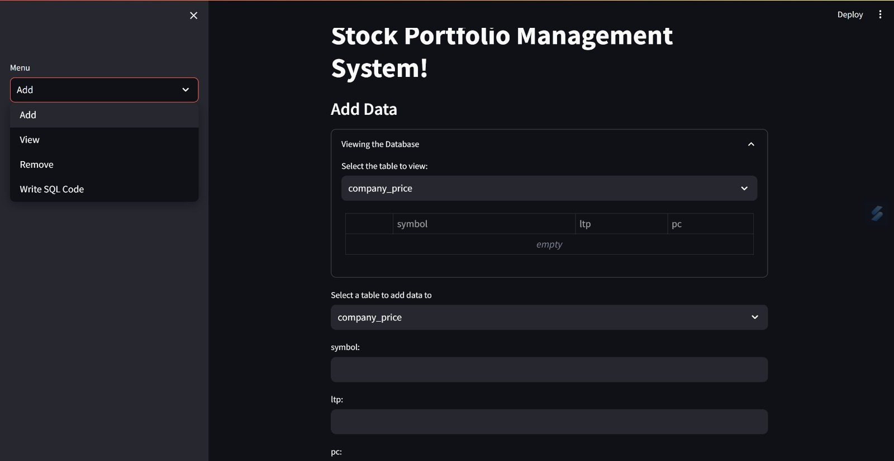

# Stock-portfolio
Stock Portfolio Management System

## Description
This is a stock portfolio management system that allows users to buy and sell stocks. The system also allows users to view their portfolio and see how much money they have made or lost. 

## Features
- Buy and sell stocks
- View portfolio
- View stock prices
- View stock news
- View stock financials

## Technologies
- Python
- Streamlit

## Screenshots

    

## Running the program
1. Clone the repository

2. Run the command `pip install streamlit` to install the required packages

3. Run the command `streamlit run app.py` to run the program

